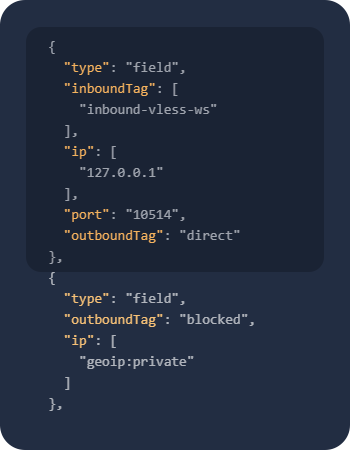
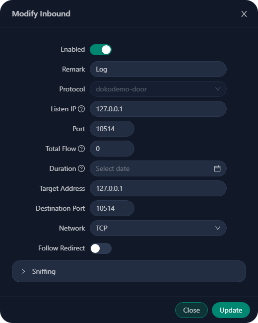
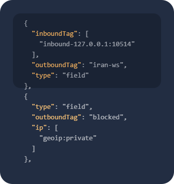

# آموزش سینک آی‌پی لیمیت (پنل 3x-ui)

[](#)
[](https://github.com/MHSanaei/3x-ui)

> **Disclaimer:** This project is only for personal learning and communication, please do not use it for illegal purposes, please do not use it in a production environment

اگر روی یک سرور خارج پنل 3x-ui نصب دارید و کاربران در آن پنل مدیریت می‌شوند و همچنین یک یا چند سرور ایران جلودست آن دارید که به صورت تانل ترافیک را به سرور خارج انتقال می‌دهند و می‌خواهید از سرویس آی‌پی لیمیت استفاده کنید این آموزش برای شما مفید خواهد بود.

> در این آموزش پنل 3x-ui در هر دو سرور خارج و ایران نصب شده است
اما شما میتوانید پنل را فقط روی سرور خارج نصب کنید و در سرور ایران (بدون نیاز به نصب پنل) fail2ban را به صورت دستی نصب و کانفیگ کنید

**گام یک:**

ابتدا باید در سرور ایران و خارج rsyslog را نصب کنید
```shell
apt install rsyslog -y
```
سپس از منوی `x-ui` گزینه‌ی `IP Limit Management` را انتخاب کنید و آی‌پی لیمیت را در هر دو سرور نصب کنید،
با دستور زیر می‌توانید اطمینان حاصل کنید که سرویس `fail2ban` بدون مشکل نصب و اجرا شده است:
```shell
systemctl status fail2ban.service
```
> اگر سرویس `fail2ban` اکتیو نبود با دستور زیر پکیج `python3` را نصب کنید و پس از آن سرویس `fail2ban` را restart کنید و مجدد status را بررسی کنید.
```shell
apt install python3-systemd -y
```
```shell
systemctl restart fail2ban.service
```

**گام دو (کانفیگ سرور ایران):**

در سرور ایران یک فایل به نام 3xipl.conf در مسیر `/etc/rsyslog.d/` ایجاد و آنرا ویرایش کنید
```shell
nano /etc/rsyslog.d/3xipl.conf
```

کانفیگ زیر را در فایل جایگذاری کنید و فایل را ذخیره کنید
```shell
module(load="imtcp")
input(type="imtcp" port="10514" address="127.0.0.1")

template(name="tp01" type="string" string="%msg:2:$%\n")

if $syslogtag == '3xipl' then {
    action(type="omfile" Template="tp01" File="/var/log/3xipl.log")
    & stop
}
```

کانفیگ json زیر را در تنظیمات xray بخش Advanced در قسمت routing قرار دهید


<div align="left">

> :warning:آنرا در بالای قانون مسدود سازی private ip قرار دهید

</div>

```json
      {
        "type": "field",
        "inboundTag": [
          "inbound-vless-ws"
        ],
        "ip": [
          "127.0.0.1"
        ],
        "port": "10514",
        "outboundTag": "direct"
      },
```
<div align="left">

> **نکته**: در `inboundTag` باید تگ اینباندی را وارد کنید که که کانفیگ آنرا در قسمت outbound سرور خارج قرار داده‌اید

</div>

در این مرحله سرور ایران شما به درستی کانفیگ شده و آماده است تا لاگ های مربوط به آی‌پی لیمیت را از سرور خارج دریافت کند و به فایل لاگ مربوطه (در سرور ایران) انتقال دهد تا سینک آی‌پی لیمیت به درستی انجام شود.

**گام سه (کانفیگ سرور خارج):**

در سرور خارج یک فایل به نام 3xipl.conf در مسیر `/etc/rsyslog.d/` ایجاد کنید و آنرا ویرایش کنید
```shell
nano /etc/rsyslog.d/3xipl.conf
```
کانفیگ زیر را در فایل کپی کنید و فایل را ذخیره کنید
```shell
module(load="imfile" Mode="inotify")

input(type="imfile"
      File="/var/log/3xipl.log"
      Tag="3xipl"
      Severity="info"
      Facility="local7"
      readMode="0"
      PersistStateInterval="1"
      freshStartTail="off"
      discardTruncatedMsg="on"
      reopenOnTruncate="on"
      persistStateAfterSubmission="on")

if $syslogtag == '3xipl' then {
   action(type="omfwd" Target="127.0.0.1" Port="10514" Protocol="tcp"
          queue.type="LinkedList"
          queue.filename="forwarding1"
          queue.maxDiskSpace="1g"
          queue.size="100000"
          queue.saveOnShutdown="on"
          action.resumeRetryCount="100")
}
```

یک اینباند dokodemo-door با پورت 10514 ایجاد کنید و آنرا مشابه تصویر زیر تنظیم کنید



کانفیگ json زیر را در تنظیمات xray بخش Advanced در قسمت routing قرار دهید


<div align="left">

> :warning:آنرا در بالای قانون مسدود سازی private ip قرار دهید

</div>

```json
      {
        "inboundTag": [
          "inbound-127.0.0.1:10514"
        ],
        "outboundTag": "iran-ws",
        "type": "field"
      },
```
<div align="left">

> **نکته**: در `outboundTag` باید تگ outbound کانفیگ ایران را وارد کنید

</div>

در این مرحله کانفیگ سرور خارج به اتمام رسید و در صورتی که اتصال تانل شما به درستی برقرار باشد لاگ های آی‌پی لیمیت به سرور ایران ارسال خواهد شد و آی‌پی ها به درستی در سرور ایران بن می‌شوند.

میتوانید با بررسی فایل زیر در هر دو سرور از سینک و انتقال صحیح لاگ اطمینان حاصل کنید.

`nano /var/log/3xipl.log`

> [!NOTE]
> همچنین بعد از انجام مراحل بالا باید time zone هر دو سرور را مشابه هم تنظیم کنید تا به لحاظ زمانی هم با یکدیگر سینک باشند، از طریق دستور زیر میتوانید time zone را روی UTC تنظیم کنید:
> 
> ```bash
> timedatectl set-timezone UTC
> ```

## توضیحات تکمیلی

  سوال پرتکراری که غالبا پرسیده شده این است که **چرا وقتی پنل 3x-ui روی سرور خارج نصب میشود و کاربران در آن مدیریت میشود آی پی لیمیت به درستی کار نمیکند!**
وقتی پنل روی سرور خارج راه اندازی میشود سه حالت کلی وجود دارد:

<div align="right">
  <details>
    <summary>1- اتصال کاربران با سرور خارج به صورت مستقیم است</summary>
در این حالت اتصال کاربران به سرور خارج کاملا به صورت مستقیم است و قطعا آی‌پی لیمیت به درستی کار خواهد کرد، در حال حاضر سرویس آی‌پی لیمیت بر پایه مسدود سازی آی‌پی توسط فایروال می‌باشد بنابراین چون کاربران به صورت مستقیم با آی‌پی خودشان به سرور متصل می‌شوند اگر آی‌پی آنها توسط فایروال مسدود شود اتصال آنها قطع خواهد شد.
  </details>
  <details>
    <summary>2- اتصال کاربران با سرور خارج از طریق CDN است</summary>
همانطور که در حالت اول توضیح داده شد آی‌پی لیمیت بر اساس مسدود سازی آی‌پی توسط فایروال <code>iptables</code> کارمیکند و توسط <code>fail2ban</code> مدیریت می‌شود
بنابراین وقتی کاربران شما از طریق CDN به سرور خارج متصل می‌شوند از طریق آی‌پی سرور های لبه CDN به سرور متصل می‌شوند
و وقتی آی‌پی آنها در فایروال مسدود می‌شود اتصال آنها همچنان برقرار خواهد ماند
به این دلیل که با یک آی‌پی واسط که آی‌پی سرور لبه CDN مورد استفاده شما می‌باشد در حال اتصال به سرور هستند.
  </details>
  <details>
    <summary>3- اتصال کاربران از طریق تانل بین یک یا چند سرور ایران و سرور خارج است</summary>
این حالت مشبه حالت دوم است با این تفاوت که شما از یک سرور ایران برای تانل و اتصال کاربران به سرور خارج استفاده می‌کنید و میتوانید از طریق این آموزش لاگ های مربوط به آی‌پی لیمیت را به سرور ایران ارسال کنید تا همزمان آی‌پی کاربران در سرور ایران مسدود شود.
  </details>
</div>